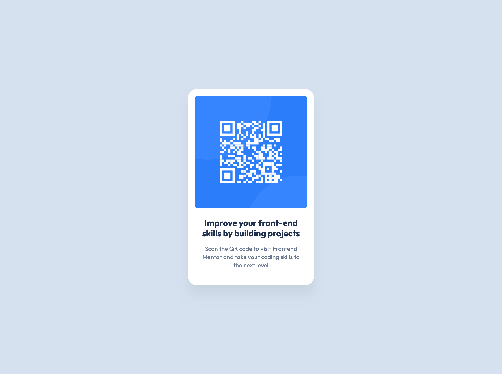

# Frontend Mentor - QR code component solution

This is a solution to the [QR code component challenge on Frontend Mentor](https://www.frontendmentor.io/challenges/qr-code-component-iux_sIO_H). Frontend Mentor challenges help you improve your coding skills by building realistic projects.

## Table of contents

- [Overview](#overview)
  - [Screenshot](#screenshot)
  - [Links](#links)
- [My process](#my-process)
  - [Built with](#built-with)
  - [What I learned](#what-i-learned)
- [Author](#author)
- [Acknowledgments](#acknowledgments)

## Overview

First challenge and the start of my FrontendMentor journey.

### Screenshot



### Links

- Solution URL: [Add solution URL here](https://your-solution-url.com)
- Live Site URL: [Add live site URL here](https://your-live-site-url.com)

## My process

### Built with

- Semantic HTML5 markup
- CSS custom properties
- Flexbox

### What I learned

Although very simple, it was good to remember how to use variants and set up a design system to use throughout the file.

```css
:root {
  --slate-900: #1f314f;
  --slate-500: #68778d;
  --slate-300: #d5e1ef;
  --white: #fff;

  --spacing-500: 40px;
  --spacing-300: 24px;
  --spacing-200: 16px;
}
```

## Author

- Frontend Mentor - [@dealencardavid](https://www.frontendmentor.io/profile/dealencardavid)
- GitHub - [@dealencardavid](https://github.com/dealencardavid)

## Acknowledgments

Hats off to FrontendMentor for enabling goood resources to new frontend developers!
